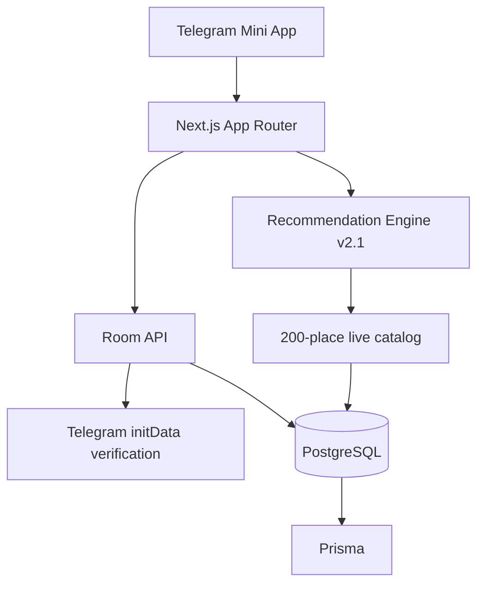

<div align="center">
  

  <br />

  **Не каталог мест. Движок принятия решения о том, куда идти прямо сейчас.**

  `v0.6 · Хабаровск · Telegram Mini App · Next.js 16 · TypeScript · PostgreSQL · Prisma`
</div>

---

## Product

**«Куда идём?»** убирает бесконечное «ну и куда пойдём?». Пользователь задаёт компанию, настроение и бюджет, приложение учитывает live-контекст и предлагает короткий список подходящих мест. С Stage 6 этот выбор можно отдать всей компании: создать комнату, отправить ссылку в Telegram и получить общий результат по независимым голосам.

> **Мы выбираем место, чтобы пользователю не пришлось.**

Launch market — **Хабаровск**. Live catalog — **200 мест**.

## Stage 6 · Telegram Rooms & Group Voting

```text
recommendations
      ↓
create persistent room
      ↓
Telegram invite / /room/[id]
      ↓
friends join
      ↓
yes / no votes
      ↓
live leader → full consensus
```

Stage 6 — уже не process-local demo. Комнаты хранятся в PostgreSQL и переживают перезапуск приложения/несколько server instances.

- до 8 мест на комнату;
- срок жизни комнаты — 24 часа;
- `Room`, `RoomMember`, `RoomOption`, `RoomVote` в Prisma;
- голос участника по месту обновляется idempotent upsert;
- live synchronization каждые ~2.2 секунды;
- connection state в UI;
- deterministic tally;
- отдельный consensus state, когда все участники выбрали одно место;
- canonical Telegram share link;
- storage outage возвращает явный `503`, а не теряет голос молча.

### Telegram identity

В Telegram Mini App клиент передаёт `Telegram.WebApp.initData`. Сервер валидирует HMAC-подпись с `TELEGRAM_BOT_TOKEN` и только после этого принимает Telegram ID/name/username как подтверждённую identity.

В обычном браузере используется стабильный anonymous member key. Browser preview не может подделать Telegram identity.

Полная спецификация: [`docs/STAGE-6.md`](./docs/STAGE-6.md).

## Production flow

```text
Stage 1  Production foundation                 ✅
Stage 2  Live Khabarovsk data layer            ✅
Stage 3  Recommendation Engine v2              ✅
Stage 4  Geolocation & live context             ✅
Stage 5  Production place experience            ✅
Stage 6  Telegram rooms & group voting          ✅
Stage 7  Analytics + closed beta                →
Stage 8  Khabarovsk public launch               →
```

Stage 5 retains the decision-to-action experience: match/confidence, live availability, distance/ETA, provenance, safe media policy, Yandex Maps route, phone/site actions, share and evening-plan continuation.

Stage 4 supplies optional location, current Khabarovsk time and live weather. Recommendation Engine v2.1 uses those signals without making geolocation mandatory.

## Architecture



Repository boundaries:

```text
app/                          routes + APIs
features/recommendations/     ranking + live context
features/places/              production place experience
features/rooms/               room domain, UI and persistence adapter
lib/context/                  weather/time/service area
lib/location/                 Telegram/browser location
lib/telegram/                 Telegram WebApp bridge
lib/db.ts                     shared Prisma runtime
prisma/                       schema + migrations
data/                          live Khabarovsk catalog
```

## Environment

```bash
DATABASE_URL=postgresql://...
TELEGRAM_BOT_TOKEN=...
```

`TELEGRAM_BOT_TOKEN` is required for verified Telegram room identity. `DATABASE_URL` is required for room persistence.

## Quality gates

```bash
npm run check
```

CI covers Prisma generation, catalog validation/audits, recommendation tests, place tests, room-domain tests, TypeScript, ESLint and production `next build`.

## Local development

```bash
git clone https://github.com/richmanstudio/kudaidem.git
cd kudaidem
npm install
cp .env.example .env
npm run dev
```

Database:

```bash
npx prisma migrate deploy
npm run db:seed
```

## Data principle

**Unknown stays unknown.** Приложение не придумывает цены, графики, рейтинги, контакты или права на изображения.

---

<div align="center">
  <strong>DUONIQ</strong><br />
  <sub>Two founders. One clear result.</sub><br /><br />
  <code>#B6FF00</code>
</div>
