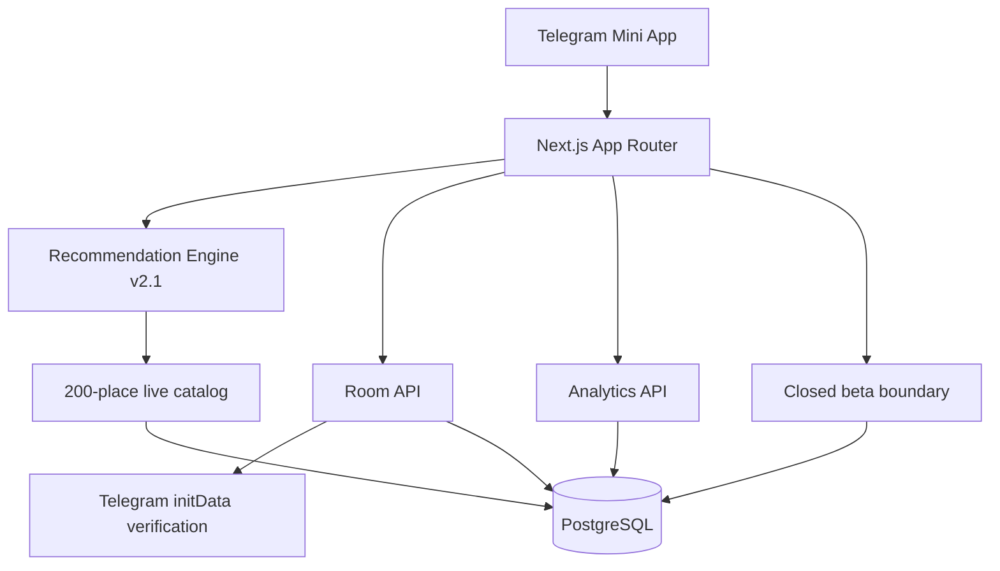

<div align="center">
  

  <br />

  **Не каталог мест. Движок принятия решения о том, куда идти прямо сейчас.**

  `v0.7 · Хабаровск · Telegram Mini App · Next.js 16 · TypeScript · PostgreSQL · Prisma`
</div>

---

## Product

**«Куда идём?»** убирает бесконечное «ну и куда пойдём?». Пользователь задаёт компанию, настроение и бюджет, приложение учитывает live-контекст и предлагает короткий список подходящих мест. Компания может создать общую Telegram-комнату и прийти к одному решению через независимые голоса.

> **Мы выбираем место, чтобы пользователю не пришлось.**

Launch market — **Хабаровск**. Live catalog — **200 мест**.

## Stage 7 · Analytics + Closed Beta

Stage 7 переводит проект из состояния feature-complete MVP в состояние **измеримого закрытого продукта**.

```text
APP_OPEN
   ↓
SEARCH_SUBMITTED
   ↓
RECOMMENDATION_SHOWN
   ↓
RECOMMENDATION_ACCEPTED
   ↓
ROUTE_OPENED
```

Воронка хранится first-party в PostgreSQL. Отдельно измеряются `ROOM_CREATED`, `ROOM_JOINED`, `ROOM_VOTED`, feedback и client errors.

- случайный analytics session ID живёт только в `sessionStorage`;
- подтверждённая Telegram identity в аналитике хранится только как hash;
- координаты пользователя не отправляются в analytics events;
- `/ops?token=...` показывает 7-дневную воронку и feedback;
- `BETA_MODE=1` включает закрытый доступ без изменения кода;
- invite-коды имеют срок действия и лимит использований;
- в БД хранится только SHA-256 hash invite-кода;
- успешный вход создаёт signed HttpOnly beta-session cookie;
- beta-тестеры могут оставить оценку и текстовый отзыв прямо из приложения.

Выпуск beta-инвайта:

```bash
npm run beta:issue -- "Khabarovsk alpha" 10 14
```

Полная спецификация: [`docs/STAGE-7.md`](./docs/STAGE-7.md).

## Production flow

```text
Stage 1  Production foundation                 ✅
Stage 2  Live Khabarovsk data layer            ✅
Stage 3  Recommendation Engine v2              ✅
Stage 4  Geolocation & live context             ✅
Stage 5  Production place experience            ✅
Stage 6  Telegram rooms & group voting          ✅
Stage 7  Analytics + closed beta                ✅
Stage 8  Khabarovsk public launch               →
```

## Architecture



Repository boundaries:

```text
app/                          routes + APIs
features/recommendations/     ranking + live context
features/places/              production place experience
features/rooms/               rooms + voting + persistence
features/analytics/           events + funnel + dashboard data
features/beta/                invite access + feedback
lib/context/                  weather/time/service area
lib/location/                 Telegram/browser location
lib/telegram/                 Telegram WebApp bridge
lib/db.ts                     shared Prisma runtime
prisma/                       schema + migrations
data/                          live Khabarovsk catalog
```

## Environment

```bash
DATABASE_URL=postgresql://...
TELEGRAM_BOT_TOKEN=...
BETA_MODE=1
BETA_SESSION_SECRET=...
OPS_DASHBOARD_TOKEN=...
```

## Quality gates

```bash
npm run check
```

CI covers Prisma generation, catalog validation/audits, recommendation/place/room/analytics tests, TypeScript, ESLint and production `next build`.

## Data principle

**Unknown stays unknown.** Приложение не выдумывает расписание, цену, рейтинг, координаты, телефон или права на изображения. Источник и freshness остаются частью production UX.

## Documentation

Stage specifications находятся в [`docs/`](./docs). Data policy и live catalog — в [`data/`](./data).
